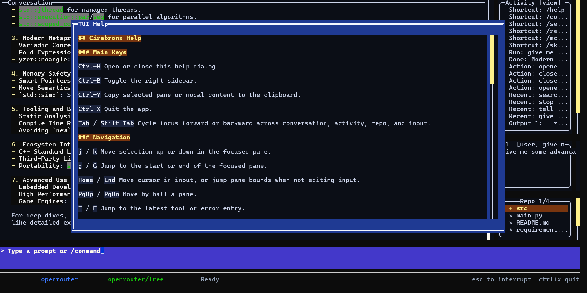

# cirebronx

`cirebronx` is a Zig-based terminal coding agent with both a direct CLI and a pane-based TUI built on top of `ziggy`.

It is aimed at local agentic coding workflows: prompt execution, tool use, file edits, shell actions, repo search, sessions, slash commands, skills, and MCP-aware extension points.

Open-source home: `https://github.com/mexyusef/cirebronx`



## Features

- Terminal-first coding agent with one-shot, REPL, and TUI modes
- Multi-provider support:
  - `openai`
  - `openrouter`
  - `anthropic`
  - `gemini`
  - `groq`
  - `cerebras`
  - `huggingface`
- Built-in tools for filesystem, shell, search, patching, web fetch, and web search
- Slash-command surface for provider, model, theme, tools, sessions, skills, commands, and MCP workflows
- Discovery of local command and skill inventories from `~/.claude` and `~/.codex`
- Theme-aware TUI with modal help, picker overlays, right sidebar toggle, and clipboard support
- Session persistence, prompt history, and resumable interactive work

## Requirements

- Zig `0.15.2`
- A sibling checkout of `ziggy` at `../ziggy`
- Provider credentials in environment variables, or an OpenRouter key pool when using the OpenRouter fallback path

## Build

```powershell
zig build test
zig build
```

## Run

```powershell
zig build run
zig build run -- --tui
zig build run -- "inspect this repository"
```

## App-Server

`cirebronx` also exposes a first headless app-server mode over WebSocket JSON-RPC 2.0.

```powershell
zig build run -- --app-server
zig build run -- --app-server 9241
```

Default listener:

```text
ws://127.0.0.1:9240
```

Current JSON-RPC methods:

- `status/read`
- `config/read`
- `session/list`
- `session/read`
- `tool/list`
- `tool/call`
- `mcp/list`
- `mcp/call`
- `turn/start`
- `turn/interrupt`

## Provider Setup

Example: Gemini

```powershell
$env:CIREBRONX_PROVIDER='gemini'
$env:GEMINI_API_KEY='...'
$env:OPENAI_MODEL='gemini-2.5-flash'
zig build run -- "hello"
```

Example: Anthropic

```powershell
$env:CIREBRONX_PROVIDER='anthropic'
$env:ANTHROPIC_API_KEY='...'
$env:OPENAI_MODEL='claude-sonnet-4-20250514'
zig build run -- "hello"
```

Example: OpenRouter

```powershell
$env:CIREBRONX_PROVIDER='openrouter'
$env:OPENAI_API_KEY='...'
zig build run -- "hello"
```

## TUI Notes

- `Ctrl+H` opens the embedded help modal
- `Ctrl+B` toggles the right sidebar
- `Ctrl+Y` copies the focused pane or modal content
- `Ctrl+X` quits
- `/` opens the slash-command palette

## Local Discovery

`cirebronx` can discover local assets from:

- `%USERPROFILE%\.claude\commands`
- `%USERPROFILE%\.claude\skills`
- `%USERPROFILE%\.codex\commands`
- `%USERPROFILE%\.codex\skills`
- project-local `./.claude/*`
- project-local `./.codex/*`

## Project Status

The project is usable for local experimentation and active development, but it is still evolving quickly. Provider behavior, tool routing, and TUI interactions are under active refinement.

## Related Repositories

- `ziggy`: terminal UI library used by the TUI
- `fmus-zig`: shared utility layer
- `zigsaw`: adjacent runtime and agent work

## License

MIT. See [LICENSE](LICENSE).
